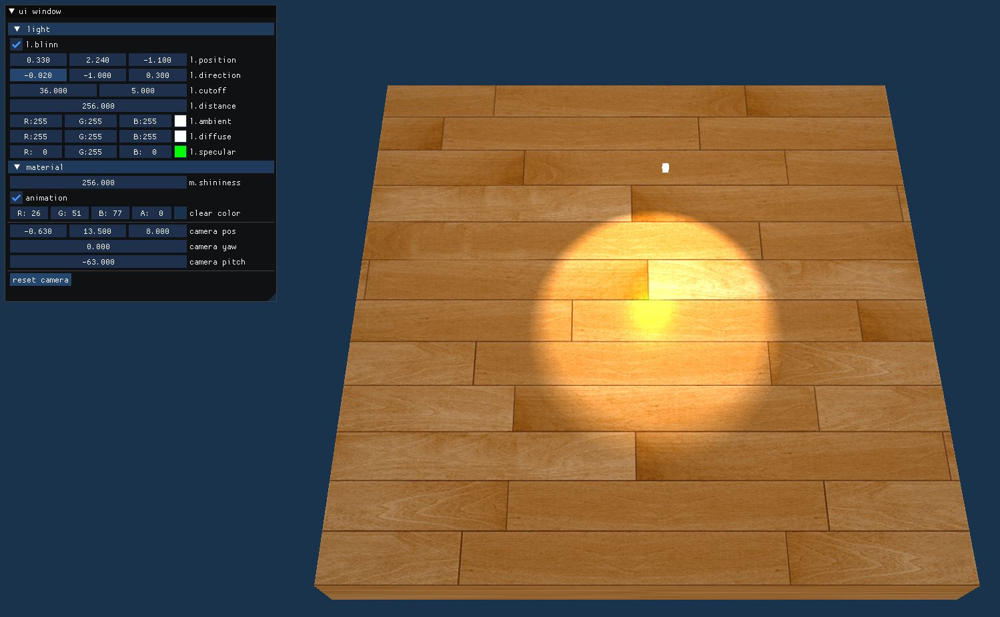

# framebuffer


- 프레임버퍼
    - OpenGL 함수를 통해 그러질 색상/깊이/스텐실 버퍼의 집합체
    - GLFW를 통해 OpenGL context를 생성하면 화면에 그림을 그리기 위한    
      프레임버퍼가 자동으로 생성됨.   
    - 개발자가 직접 프레임버퍼를 생성하고 활용할 수 있음.
        - 랜더링된 장면을 텍스쳐로 활용하는 경우
        - 프스트프로세싱

- 프레임버퍼 사용과정
    - 프레임버퍼 객체 생성
    - 랜더버퍼(color/depth/stencil) 생성
    - 렌더버퍼를 프레임버퍼에 연결
    - 해당 렌더버퍼의 조합이 프레임버퍼로 사용가능한지 확인


### Creating a framebuffer

- 프레임버퍼 객체 생성하기

```cpp
GLuint fbo;
glGenFrameBuffers(1, &fbo);
```

- bindinga
생성된 framebuffer를 active 프레임버퍼로 바인딩 해야함.   
```cpp
glBindFramebuffer(GL_FRAMEBUFFER, fbo);
```

- 프레임버퍼 생성을 위한 요구조건
    - We have to attach at least one buffer (color, depth or stencil buffer).
    - There should be at least one color attachment.
    - All attachments should be complete as well (reserved memory).
    - Each buffer should have the same number of samples.

    마지막으로 **glCheckFramebufferStatus()** 사용해 모두요구 조건이 만족되지는   
    확인하는 과정이 필요함. 

    ```cpp
    if (glCheckFramebufferStatus(GL_FRAMEBUFFER) == GL_FRAMEBUFFER_COMPLETE)
    //Execute victory dance
    ```

- 디폴트 프레임버퍼로 binding하는 명령

```cpp
glBindFramebuffer(GL_FRAMEBUFFER, 0)
```

- 프레임버퍼에 연결하는 Attachment를 생성하는 방법

    ### attachment의 정의
    프레임버퍼랑 연결되는 bffer를 말함.   
    color attachment에는 텍스처가 사용되고,   
    스탠실과 뎁스버퍼를 위해서는 renderbuffer가 사용됨.   
          
    An attachment is a memory location that can act as a buffer for the framebuffer,   
    think of it as an image. When creating an attachment we have two options to take:   
    textures or renderbuffer objects.

- **Texture attachments 생성**  
    Creating a texture for a framebuffer is roughly the same as a normal texture:   
    ```cpp
    GLuint texture;
    glGenTextures(1, &texture)
    glBindTexture(GL_TEXTURE_2D, texture);

    glTextImage2D(GL_TEXTURE_2D, 0, GL_RGB, 800,600, 0, GL_RGB, GL_UNSIGNED_BYTE, NULL);
    glTexParameteri(GL_TEXTURE_2D, GL_TEXTURE_MIN_FILTER, GL_LINEAR);
    glTexParameteri(GL_TEXTURE_2D, GL_TEXTURE_MAG_FILTER, GL_LINEAR);
    
    ```
    The main differences here is that we set the dimensions equal to the screen size   
    (although this is not required) and we pass NULL as the texture’s data parameter.    
    For this texture, we’re only allocating memory and not actually filling it.    
    Filling the texture will happen as soon as we render to the framebuffer

- **Texture attachments를 framebuffer에 붙이기**
    ```cpp
        glFramebufferTexture2D(GL_FRAMEBUFFER,
                            GL_COLOR_ATTACHMENT0, 
                            GL_TEXTURE_2D,
                            texture, 
                            0);
    ```

    The glFrameBufferTexture2D has the following parameters:   
    • target: the framebuffer type we’re targeting (draw, read or both).   
    • attachment: the type of attachment we’re going to attach.   
      Right now we’re attaching a color attachment.   
      Note that the 0 at the end suggests we can attach more than 1 color   
      attachment. We’ll get to that in a later tutorial.  
    • textarget: the type of the texture you want to attach.   
    • texture: the actual texture to attach.   
    • level: the mipmap level. We keep this at 0.  


- **renderbuffer attachments 생성**   
    A renderbuffer object has the added advantage though that   
    it stores its data in OpenGL’s native rendering format   
    making it optimized for off-screen rendering to a framebuffer.

    Creating a renderbuffer object looks similar to the framebuffer’s code:

    ```cpp
    GLuint rbo;
    glGenRenderBuffers(1, &rbo);
    glBindRenderbuffer(GL_RENDERBUFFER, rbo);
    ```

    Creating a depth and stencil renderbuffer object is done 
    by calling the **glRenderbufferStorage** function:

    뎁스와 스텐실 버퍼를 동시 생성함.
    ```cpp
    glRenderBufferStorage(GL_RENDERBUFFER, GL_DEPTH24_STENCIL8, 800, 600);
    ```
    프레임버퍼에 붙이기

    ```cpp
    glFramebufferRenderbuffer(GL_FRAMEBUFFER, GL_DEPTH_STENCIL_ATTACHMENT, GL_RENDERBUFFER, rbo);
    ```

- **프레임버퍼가 생성이 완료되었는지 확인해야함**

```cpp
if(glCheckFramebufferStatus(GL_FRAMEBUFFER) != GL_FRAMEBUFFER_COMPLETE)
    cout << "ERROR::FRAMEBUFFER:: Framebuffer is not complete!" << endl;
glBindFramebuffer(GL_FRAMEBUFFER, 0);
```


# 프레임버퍼 클래스 구현

`framebuffer.h`
```cpp
CLASS_PTR(Framebuffer);
class Framebuffer {
public:
    static FramebufferUPtr Create(const TexturePtr colorAttachment);
    static void BindToDefault();
    ~Framebuffer();

    const uint32_t Get() const { return m_framebuffer; }
    void Bind() const;
    const TexturePtr GetColorAttachment() const { return m_colorAttachment; }

private:
    Framebuffer() {}
    bool InitWithColorAttachment(const TexturePtr colorAttachment);

    uint32_t m_framebuffer { 0 };
    uint32_t m_depthStencilBuffer { 0 };
    TexturePtr m_colorAttachment;
};
```

`framebuffer.cpp`

프레임버퍼는 color buffer를 위해 텍스처를 사용함.  
사용할 텍스처를 외부에서 입력으로 받음.

```cpp
#include "framebuffer.h"

FramebufferUPtr Framebuffer::Create(const TexturePtr colorAttachment) {
    auto framebuffer = FramebufferUPtr(new Framebuffer());
    if (!framebuffer->InitWithColorAttachment(colorAttachment))
        return nullptr;
    return std::move(framebuffer);
}
```

생성된 renderbuffer와 framebuffer를 삭제함.  
```cpp
Framebuffer::~Framebuffer() {
    if (m_depthStencilBuffer) {
        glDeleteRenderbuffers(1, &m_depthStencilBuffer);
    }
    if (m_framebuffer) {
        glDeleteFramebuffers(1, &m_framebuffer);
    }
}
```

```cpp
//액티브 프레임버퍼를 디폴트 프레임버퍼로 바꿈
void Framebuffer::BindToDefault() {
    glBindFramebuffer(GL_FRAMEBUFFER, 0);
}

void Framebuffer::Bind() const {
    glBindFramebuffer(GL_FRAMEBUFFER, m_framebuffer);
}
```

텍스처와 renderbuffer를 프레임버퍼와 연결함.
```cpp
bool Framebuffer::InitWithColorAttachment(const TexturePtr colorAttachment) {
    m_colorAttachment = colorAttachment;
    glGenFramebuffers(1, &m_framebuffer);
    glBindFramebuffer(GL_FRAMEBUFFER, m_framebuffer);

    glFramebufferTexture2D(GL_FRAMEBUFFER,
                            GL_COLOR_ATTACHMENT0, GL_TEXTURE_2D,
                            colorAttachment->Get(), 0);

    glGenRenderbuffers(1, &m_depthStencilBuffer);
    glBindRenderbuffer(GL_RENDERBUFFER, m_depthStencilBuffer);
    glRenderbufferStorage(
                        GL_RENDERBUFFER, GL_DEPTH24_STENCIL8,
                        colorAttachment->GetWidth(), colorAttachment->GetHeight());
    glBindRenderbuffer(GL_RENDERBUFFER, 0);

    glFramebufferRenderbuffer(
                        GL_FRAMEBUFFER, GL_DEPTH_STENCIL_ATTACHMENT,
                        GL_RENDERBUFFER, m_depthStencilBuffer);

    auto result = glCheckFramebufferStatus(GL_FRAMEBUFFER);
    if (result != GL_FRAMEBUFFER_COMPLETE) {
        SPDLOG_ERROR("failed to create framebuffer: {}", result);
        return false;
    }

    BindToDefault();

    return true;
}
```

# Framebuffer 클래스 사용법

1. `context.h` 에서 FrameBuffer를 인스턴스를 선언함.

```cpp
FramebufferUPtr m_framebuffer;
```

2. 화면의 크기에 크기에 맞는 텍스처 attatchment를 생성해야함.

```cpp
void Context::Reshape(int width, int height) {
    m_width = width;
    m_height = height;
    glViewport(0, 0, m_width, m_height);

    m_framebuffer = Framebuffer::Create(Texture::Create(width, height, GL_RGBA));
}
```

3. 액티브 프레임버터를 m_framebuffer로 변경해야함.

`contex.cpp`의 Render() 함수에서 호출됨. 
clear 함수전에 호출되어야함.  

```cpp

    m_framebuffer->Bind();
    glClear(GL_COLOR_BUFFER_BIT | GL_DEPTH_BUFFER_BIT);
```

4.  Framebuffer::BindToDefault()를 호출하여 디폴트 액티브 버퍼로 변경함.

5. 사용자 framebuffer의 texture가 그려진 화면의 이미지를 다시 화면에 그림.
```cpp
    glClear(GL_COLOR_BUFFER_BIT | GL_DEPTH_BUFFER_BIT | GL_STENCIL_BUFFER_BIT);

    m_textureProgram->Use();
    m_textureProgram->SetUniform("transform", glm::scale(glm::mat4(1.0f), glm::vec3(2.0f, 2.0f, 1.0f)));
    m_framebuffer->GetColorAttachment()->Bind();
    m_textureProgram->SetUniform("tex", 0);
    m_plane->Draw(m_textureProgram.get());
```

6. 프레임버퍼의 내용


7. 전체 Render() 함수의 내용

```cpp
void Context::Render() {


    DispatchImGui();

    m_framebuffer->Bind();

    glClear(GL_COLOR_BUFFER_BIT | GL_DEPTH_BUFFER_BIT);

    m_cameraFront =
        glm::rotate(glm::mat4(1.0f),
            glm::radians(m_cameraYaw), glm::vec3(0.0f, 1.0f, 0.0f)) *
        glm::rotate(glm::mat4(1.0f),
            glm::radians(m_cameraPitch), glm::vec3(1.0f, 0.0f, 0.0f)) *
        glm::vec4(0.0f, 0.0f, -1.0f, 0.0f);

    auto projection = glm::perspective(glm::radians(45.0f),
        (float)m_width / (float)m_height, 0.01f, 100.0f);

    auto view = glm::lookAt(
        m_cameraPos,
        m_cameraPos + m_cameraFront,
        m_cameraUp);

    auto lightModelTransform =
        glm::translate(glm::mat4(1.0), m_light.position) *
        glm::scale(glm::mat4(1.0), glm::vec3(0.1f));
    m_simpleProgram->Use();
    m_simpleProgram->SetUniform("color", glm::vec4(m_light.ambient + m_light.diffuse, 1.0f));
    m_simpleProgram->SetUniform("transform", projection * view * lightModelTransform);
    m_box->Draw(m_simpleProgram.get());

    m_program->Use();
    m_program->SetUniform("viewPos", m_cameraPos);
    m_program->SetUniform("light.position", m_light.position);
    m_program->SetUniform("light.direction", m_light.direction);
    m_program->SetUniform("light.cutoff", glm::vec2(
        cosf(glm::radians(m_light.cutoff[0])),
        cosf(glm::radians(m_light.cutoff[0] + m_light.cutoff[1]))));
    m_program->SetUniform("light.attenuation", GetAttenuationCoeff(m_light.distance));
    m_program->SetUniform("light.ambient", m_light.ambient);
    m_program->SetUniform("light.diffuse", m_light.diffuse);
    m_program->SetUniform("light.specular", m_light.specular);
    m_program->SetUniform("blinn", (m_blinn ? 1 : 0));

    auto modelTransform =
                glm::translate(glm::mat4(1.0f), glm::vec3(0.0f, -0.5f, 0.0f)) *
                glm::scale(glm::mat4(1.0f), glm::vec3(10.0f, 1.0f, 10.0f));
    
    auto transform = projection * view * modelTransform;
    m_program->SetUniform("transform", transform);
    m_program->SetUniform("modelTransform", modelTransform);
    m_planeMaterial->SetToProgram(m_program.get());
    m_box->Draw(m_program.get());

    Framebuffer::BindToDefault();

    glClear(GL_COLOR_BUFFER_BIT | GL_DEPTH_BUFFER_BIT | GL_STENCIL_BUFFER_BIT);

    m_textureProgram->Use();
    m_textureProgram->SetUniform("transform", glm::scale(glm::mat4(1.0f), glm::vec3(2.0f, 2.0f, 1.0f)));
    m_framebuffer->GetColorAttachment()->Bind();
    m_textureProgram->SetUniform("tex", 0);
    m_plane->Draw(m_textureProgram.get());    
}

```

