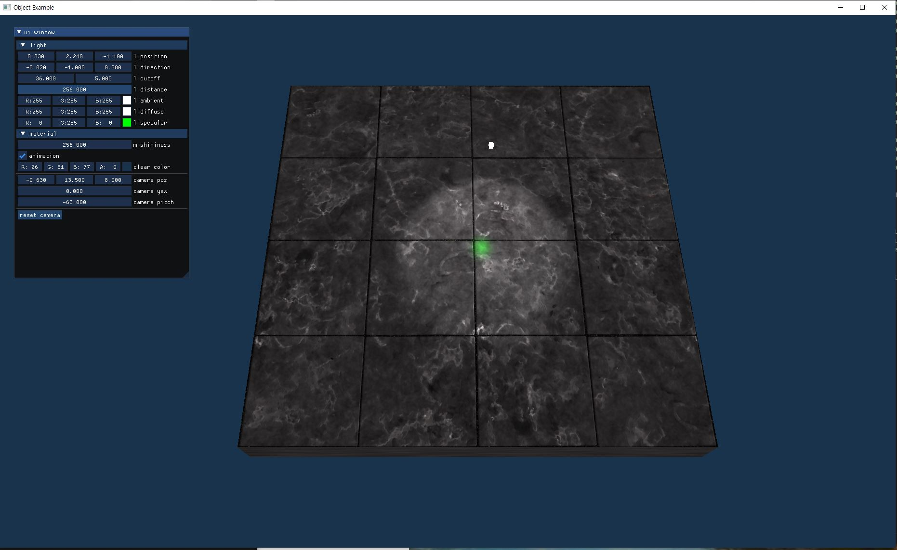
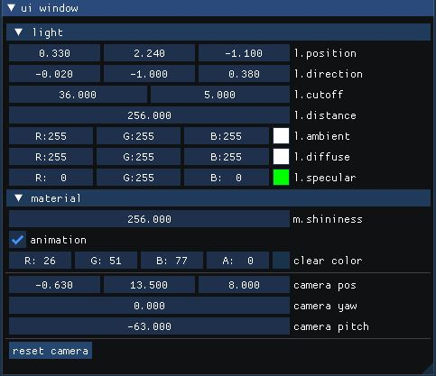

# 코드의 대략적 설명
<!-- TOC -->
- [1. Introduction](#introduction)
- [2. 주요코드를 분석함](#majorcode)
    - [2-1 Context::Init()](###1-먼저-**context.cpp**의-init()-메서드)
    - [Mesh::CreateBox()](###2-Mesh::CreateBox())
    - [Mesh::Render()](###3-mesh::Render())
<!-- /TOC -->

# Introduction
퐁 세이딩을 설명하는 코드를 분석한다.  

# MajorCode

### 1. 먼저 **context.cpp**의 init() 메서드 

코드의 entry는 context.cpp의 init()이다.   
주요내용은 박스 메시, 세이더, 텍스처, 매터리얼을 생성함.

`context.cpp`
```cpp
bool Context::Init() {
    glEnable(GL_DEPTH_TEST);
    glClearColor(m_clearColor.r, m_clearColor.g, m_clearColor.b, m_clearColor.a);

    m_box = Mesh::CreateBox();

    m_simpleProgram = Program::Create("./shader/simple.vs", "./shader/simple.fs");
    if (!m_simpleProgram)
        return false;

    m_program = Program::Create("./shader/lighting.vs", "./shader/lighting.fs");
    if (!m_program)
        return false;

    SPDLOG_INFO("program id: {}", m_program->Get());


    TexturePtr darkGrayTexture = Texture::CreateFromImage(
                                    Image::CreateSingleColorImage(4, 4,
                                    glm::vec4(0.2f, 0.2f, 0.2f, 1.0f)).get());

    TexturePtr grayTexture = Texture::CreateFromImage(
                                Image::CreateSingleColorImage(4, 4,
                                glm::vec4(0.5f, 0.5f, 0.5f, 1.0f)).get());
        
    m_planeMaterial = Material::Create();
    m_planeMaterial->diffuse = Texture::CreateFromImage(
                                Image::Load("./image/marble.jpg").get());
    m_planeMaterial->specular = grayTexture;
    m_planeMaterial->shininess = 256.0f;

    m_box1Material = Material::Create();
    m_box1Material->diffuse = Texture::CreateFromImage(
                                Image::Load("./image/container.jpg").get());
    m_box1Material->specular = darkGrayTexture;
    m_box1Material->shininess = 16.0f;

    m_box2Material = Material::Create();
    m_box2Material->diffuse = Texture::CreateFromImage(
                                Image::Load("./image/container2.png").get());
    m_box2Material->specular = Texture::CreateFromImage(
                                Image::Load("./image/container2_specular.png").get());
    m_box2Material->shininess = 64.0f;
 

    return true;
}

```

### 2 Mesh::CreateBox()

**Mesh::CreateBox()** 는 원점이 중심인 크기가 1단위인 박스를 생성하고  
메시에 사용되는 vertex attribute와 index를 초기화함.
   

`mesh.cpp`
```cpp
MeshUPtr Mesh::CreateBox() {
    std::vector<Vertex> vertices = {
        //vertex, normal, texture coordinate
        Vertex { glm::vec3(-0.5f, -0.5f, -0.5f), glm::vec3( 0.0f,  0.0f, -1.0f), glm::vec2(0.0f, 0.0f) },
        Vertex { glm::vec3( 0.5f, -0.5f, -0.5f), glm::vec3( 0.0f,  0.0f, -1.0f), glm::vec2(1.0f, 0.0f) },
        Vertex { glm::vec3( 0.5f,  0.5f, -0.5f), glm::vec3( 0.0f,  0.0f, -1.0f), glm::vec2(1.0f, 1.0f) },
        Vertex { glm::vec3(-0.5f,  0.5f, -0.5f), glm::vec3( 0.0f,  0.0f, -1.0f), glm::vec2(0.0f, 1.0f) },

        Vertex { glm::vec3(-0.5f, -0.5f,  0.5f), glm::vec3( 0.0f,  0.0f,  1.0f), glm::vec2(0.0f, 0.0f) },
        Vertex { glm::vec3( 0.5f, -0.5f,  0.5f), glm::vec3( 0.0f,  0.0f,  1.0f), glm::vec2(1.0f, 0.0f) },
        Vertex { glm::vec3( 0.5f,  0.5f,  0.5f), glm::vec3( 0.0f,  0.0f,  1.0f), glm::vec2(1.0f, 1.0f) },
        Vertex { glm::vec3(-0.5f,  0.5f,  0.5f), glm::vec3( 0.0f,  0.0f,  1.0f), glm::vec2(0.0f, 1.0f) },

        Vertex { glm::vec3(-0.5f,  0.5f,  0.5f), glm::vec3(-1.0f,  0.0f,  0.0f), glm::vec2(1.0f, 0.0f) },
        Vertex { glm::vec3(-0.5f,  0.5f, -0.5f), glm::vec3(-1.0f,  0.0f,  0.0f), glm::vec2(1.0f, 1.0f) },
        Vertex { glm::vec3(-0.5f, -0.5f, -0.5f), glm::vec3(-1.0f,  0.0f,  0.0f), glm::vec2(0.0f, 1.0f) },
        Vertex { glm::vec3(-0.5f, -0.5f,  0.5f), glm::vec3(-1.0f,  0.0f,  0.0f), glm::vec2(0.0f, 0.0f) },

        Vertex { glm::vec3( 0.5f,  0.5f,  0.5f), glm::vec3( 1.0f,  0.0f,  0.0f), glm::vec2(1.0f, 0.0f) },
        Vertex { glm::vec3( 0.5f,  0.5f, -0.5f), glm::vec3( 1.0f,  0.0f,  0.0f), glm::vec2(1.0f, 1.0f) },
        Vertex { glm::vec3( 0.5f, -0.5f, -0.5f), glm::vec3( 1.0f,  0.0f,  0.0f), glm::vec2(0.0f, 1.0f) },
        Vertex { glm::vec3( 0.5f, -0.5f,  0.5f), glm::vec3( 1.0f,  0.0f,  0.0f), glm::vec2(0.0f, 0.0f) },

        Vertex { glm::vec3(-0.5f, -0.5f, -0.5f), glm::vec3( 0.0f, -1.0f,  0.0f), glm::vec2(0.0f, 1.0f) },
        Vertex { glm::vec3( 0.5f, -0.5f, -0.5f), glm::vec3( 0.0f, -1.0f,  0.0f), glm::vec2(1.0f, 1.0f) },
        Vertex { glm::vec3( 0.5f, -0.5f,  0.5f), glm::vec3( 0.0f, -1.0f,  0.0f), glm::vec2(1.0f, 0.0f) },
        Vertex { glm::vec3(-0.5f, -0.5f,  0.5f), glm::vec3( 0.0f, -1.0f,  0.0f), glm::vec2(0.0f, 0.0f) },

        Vertex { glm::vec3(-0.5f,  0.5f, -0.5f), glm::vec3( 0.0f,  1.0f,  0.0f), glm::vec2(0.0f, 1.0f) },
        Vertex { glm::vec3( 0.5f,  0.5f, -0.5f), glm::vec3( 0.0f,  1.0f,  0.0f), glm::vec2(1.0f, 1.0f) },
        Vertex { glm::vec3( 0.5f,  0.5f,  0.5f), glm::vec3( 0.0f,  1.0f,  0.0f), glm::vec2(1.0f, 0.0f) },
        Vertex { glm::vec3(-0.5f,  0.5f,  0.5f), glm::vec3( 0.0f,  1.0f,  0.0f), glm::vec2(0.0f, 0.0f) },
    };

    std::vector<uint32_t> indices = {
         0,  2,  1,  2,  0,  3,
         4,  5,  6,  6,  7,  4,
         8,  9, 10, 10, 11,  8,
        12, 14, 13, 14, 12, 15,
        16, 17, 18, 18, 19, 16,
        20, 22, 21, 22, 20, 23,
    };

    return Create(vertices, indices, GL_TRIANGLES);
}
```

### 3 Mesh::Render()

다음 그림은 레더링의 결과 이다. 

    
  
그림 1. phong shading   
    
Render() 함수는 두개의 박스를 그린다.  
하나는 조명, 나머지는 플로어이다.

조명을 렌더링하는 코드이다.  
조명에 대한 파라미터는 다음과 같다.

   

그림 2. lighting parameters

``` cpp
auto lightModelTransform =
    glm::translate(glm::mat4(1.0), m_light.position) *
    glm::scale(glm::mat4(1.0), glm::vec3(0.1f));
m_simpleProgram->Use();
m_simpleProgram->SetUniform("color", glm::vec4(m_light.ambient + m_light.diffuse, 1.0f));
m_simpleProgram->SetUniform("transform", projection * view * lightModelTransform);
m_box->Draw(m_simpleProgram.get());
```


floor를 렌더링하는 코드는 다음과 같다. 

```cpp
m_program->Use();
m_program->SetUniform("viewPos", m_cameraPos);
m_program->SetUniform("light.position", m_light.position);
m_program->SetUniform("light.direction", m_light.direction);
m_program->SetUniform("light.cutoff", glm::vec2(
    cosf(glm::radians(m_light.cutoff[0])),
    cosf(glm::radians(m_light.cutoff[0] + m_light.cutoff[1]))));
m_program->SetUniform("light.attenuation", GetAttenuationCoeff(m_light.distance));
m_program->SetUniform("light.ambient", m_light.ambient);
m_program->SetUniform("light.diffuse", m_light.diffuse);
m_program->SetUniform("light.specular", m_light.specular);

auto modelTransform =
            glm::translate(glm::mat4(1.0f), glm::vec3(0.0f, -0.5f, 0.0f)) *
            glm::scale(glm::mat4(1.0f), glm::vec3(10.0f, 1.0f, 10.0f));

auto transform = projection * view * modelTransform;
m_program->SetUniform("transform", transform);
m_program->SetUniform("modelTransform", modelTransform);
m_planeMaterial->SetToProgram(m_program.get());
m_box->Draw(m_program.get());
```

Render()함수에서는 두개의 세이더를 동시에 사용하고 있다.  
세이더가 2개이기 때문에 두개를 구별하여 유니폼과 vertex 데이터를  
전달해야함.

사용중인 세이더를 선택하기 위해 Program::Use()를 사용해야 함.

<hr/>

### 조명 렌더링  

<hr/>

```cpp
void Program::Use() const {
    glUseProgram(m_program);
}
```

이후 부터 필요한 유니폼을 전달한다. 
아래는 조명을 렌더링하는데 사용되는 uniform을 전달함.

simple.vs의 transform 유니폼에 데이터를 전달함.

```cpp
m_simpleProgram->SetUniform("transform", projection * view * lightModelTransform);
```

`simple.vs`
```cpp
#version 330 core
layout (location = 0) in vec3 aPos;

uniform mat4 transform;

void main() {
    gl_Position = transform * vec4(aPos, 1.0);
}
```

simple.fs의 color 유니폼에 데이터를 전달함.  

```cpp
 m_simpleProgram->SetUniform("color", glm::vec4(m_light.ambient + m_light.diffuse, 1.0f));
```
`simple.fs`
```cpp
#version 330 core
uniform vec4 color;
out vec4 fragColor;

void main() {
    fragColor = color;
}
```

박스를 그리는 함수를 보자.
```cpp
m_box->Draw(m_simpleProgram.get());
```

Draw() 함수의 내용을 보자.   
m_vertexLayout->Bind() 함수를 사용하여   
shader가 사용할 vertex attribute를 바이딩한다.   
막지막으로 바인딩된 버텍스 속성을 glDrawElements()   
사용하여 그린다.

```cpp
void Mesh::Draw(const Program* program) const {
    m_vertexLayout->Bind();
    if (m_material) {
        m_material->SetToProgram(program);
    }
    glDrawElements(m_primitiveType, m_indexBuffer->GetCount(), GL_UNSIGNED_INT, 0);
}
```


<hr/>

### 바닥(Floor) 렌더링  

<hr/>

바닥을 만들리기 위해서 1단위 크기의 박스를 x,z 방향으로 10배 스케일링함.    
***glm::scale(glm::mat4(1.0f), glm::vec3(10.0f, 1.0f, 10.0f))***

```cpp
    auto modelTransform =
                glm::translate(glm::mat4(1.0f), glm::vec3(0.0f, -0.5f, 0.0f)) *
                glm::scale(glm::mat4(1.0f), glm::vec3(10.0f, 1.0f, 10.0f));
```

바닥은 텍스처가 적용되어 있다.   그림 1. 참조   
각각 diffuse와 specular에 대응됨.

```cpp
    TexturePtr grayTexture = Texture::CreateFromImage(
                                Image::CreateSingleColorImage(4, 4,
                                glm::vec4(0.5f, 0.5f, 0.5f, 1.0f)).get());
        
    m_planeMaterial = Material::Create();
    m_planeMaterial->diffuse = Texture::CreateFromImage(
                                Image::Load("./image/marble.jpg").get());
    m_planeMaterial->specular = grayTexture;
    m_planeMaterial->shininess = 256.0f;
```

프레먼트 쉐이더에 두개의 텍스처를 보내야 한다.   

텍스처를 shader program에 올바르게 제공하는 방법  
-  glActiveTexture(textureSlot) 함수로 현재 다루고자 하는 텍스처 슬롯을 선택   
-  glBindTexture(textureType, textureId) 함수로 현재 설정중인 텍스처 슬롯에 우리의 텍스처 오브젝트를 바인딩   
-  glGetUniformLocation() 함수로 shader 내의 sampler2D uniform 핸들을 얻어옴   
-  glUniform1i() 함수로 sampler2D uniform에 텍스처 슬롯 인덱스를 입력

SetToProgram() 메소드가 위의 동작을 수행함.

```cpp
void Material::SetToProgram(const Program* program) const {
    int textureCount = 0;
    if (diffuse) {
        glActiveTexture(GL_TEXTURE0 + textureCount);
        program->SetUniform("material.diffuse", textureCount);
        diffuse->Bind();
        textureCount++;
    }
    if (specular) {
        glActiveTexture(GL_TEXTURE0 + textureCount);
        program->SetUniform("material.specular", textureCount);
        specular->Bind();
        textureCount++;
    }
    glActiveTexture(GL_TEXTURE0);
    program->SetUniform("material.shininess", shininess);
}
```

