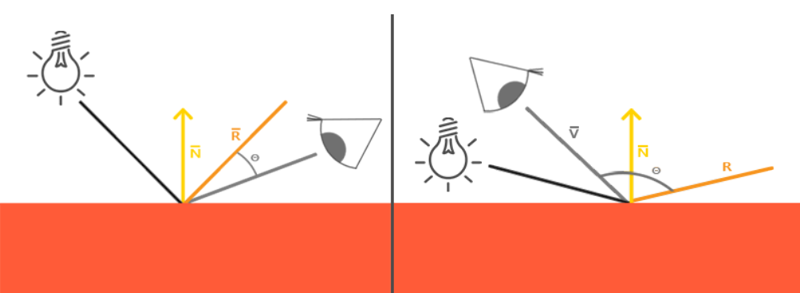
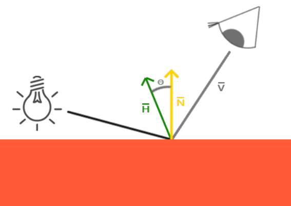
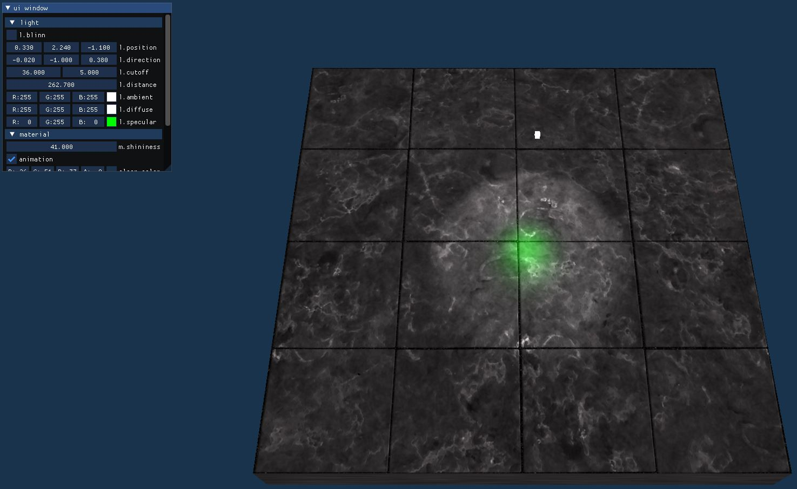

# 블린 세이딩를 구현함.


- Phong shading의 문제점 원인   
    - Specular를 계산할 때 view와 reflection간의 각도가 90도보다 커지는 경우
    - doc product값이 0보다 작아져 cutoff가 발생   


[그림 1]

- Blinn이 제안한 방식
    - view와 light를 이등분하는 벡터(halfway)와 normal 벡터 간의 사잇각으로 반사 성분을 계산함.
    - view가 reflection과 일치할때 halfway 벡터는 normal 벡터와 일치하게됨.

## $$\frac{L+V}{\left\lvert L+V \right\rvert}$$


[그림 2]


## phong vs blinn 결과 비교

blinn shading 쪽이 넓은 영역을 차지함.
녹색 하일라이트가 specular 항이다.



[그림 3] phong shading의 결과

   

[그림 4] blinn poing shading의 결과


`lighting.vs`

```cpp
#version 330 core
in vec3 normal;
in vec2 texCoord;
in vec3 position;
out vec4 fragColor;

uniform vec3 viewPos;

struct Light {
    vec3 position;
    vec3 direction;
    vec2 cutoff;
    vec3 attenuation;
    vec3 ambient;
    vec3 diffuse;
    vec3 specular;
};
uniform Light light;

struct Material {
    sampler2D diffuse;
    sampler2D specular;
    float shininess;
};
uniform Material material;
uniform int blinn;

void main() {
    vec3 texColor = texture2D(material.diffuse, texCoord).xyz;
    vec3 ambient = texColor * light.ambient;

    float dist = length(light.position - position);
    vec3 distPoly = vec3(1.0, dist, dist*dist);
    float attenuation = 1.0 / dot(distPoly, light.attenuation);
    vec3 lightDir = (light.position - position) / dist;

    vec3 result = ambient;
    float theta = dot(lightDir, normalize(-light.direction));
    float intensity = clamp(
        (theta - light.cutoff[1]) / (light.cutoff[0] - light.cutoff[1]),
        0.0, 1.0);

    if (intensity > 0.0) {
        vec3 pixelNorm = normalize(normal);
        float diff = max(dot(pixelNorm, lightDir), 0.0);
        vec3 diffuse = diff * texColor * light.diffuse;

        vec3 specColor = texture2D(material.specular, texCoord).xyz;
        float spec = 0.0;
        if (blinn == 0) {
            vec3 viewDir = normalize(viewPos - position);
            vec3 reflectDir = reflect(-lightDir, pixelNorm);
            spec = pow(max(dot(viewDir, reflectDir), 0.0), material.shininess);
        }
        else {
            vec3 viewDir = normalize(viewPos - position);
            vec3 halfDir = normalize(lightDir + viewDir);
            spec = pow(max(dot(halfDir, pixelNorm), 0.0), material.shininess);
        }
        vec3 specular = spec * specColor * light.specular;

        result += (diffuse + specular) * intensity;
    }

    result *= attenuation;
    fragColor = vec4(result, 1.0);
}

```

여기 코드에서 blinn phong의 specular를 계산하는 부분은   
다음이다.

```cpp
    vec3 viewDir = normalize(viewPos - position);
    vec3 halfDir = normalize(lightDir + viewDir);
    spec = pow(max(dot(halfDir, pixelNorm), 0.0), material.shininess);
```

